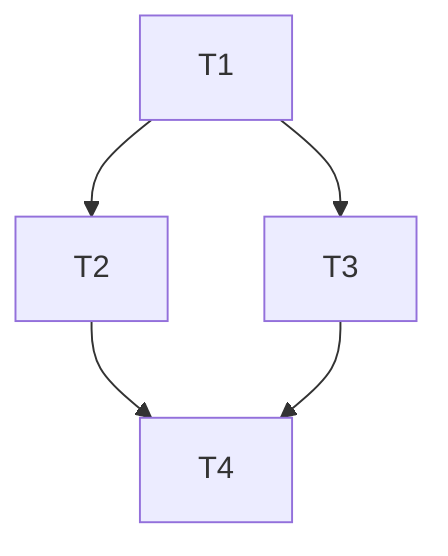

# Task Decomposition

実装対象を自己完結タスク群へ分解し、タスクリストとして書き出す。分解するかどうかの判断もこのスキルが担い、出力は「分解して進める（タスクリスト）」「分解せず直接実装する」「設計・調査へ差し戻す」の3種のいずれかになる。分解は一発で完璧にしなくてよく、調査結果や実装中の発見を受けて見直す前提で運用する。

## 分解の要否・可否判断

### 要否（分解に値するか）

予測変更ファイルが1〜2個で単一責務に収まる依頼は分解に値しない。「分解せず直接実装する」を提案して終える。変更が複数のファイル・モジュールに及ぶ見込み、または工程（実装・テスト・ドキュメント等）が複数の独立した作業に分かれる見込みなら、分解を検討する。

### 可否（分解できる状態か）

分解が成立するのは、設計が確定して実装だけが残っている仕事である。次のシグナルがあれば分解を進めず、「設計・スパイク・調査への差し戻し」をユーザーへ提案する。

- **受け入れ条件を事前に書けない。** 探索・調査・デバッグ・チューニングのような「やってみて分かる」仕事は、事前分解が虚構になる。
- **切れ目が自然に存在しない。** 予測変更ファイル集合がほぼ全タスクで重なる横断的変更は、無理に切ると各タスクが他タスクの文脈なしに仕様を書けず、統合コストが利得を食い潰す。
- **briefが本体より重い。** 子へ渡す自己完結の仕様を書くコストが、直接実装するコストに近づくなら委譲は割に合わない。
- **序盤の結果次第で残りの定義が変わる見込みが高い。** この場合は不適合ではなく、不確定な部分を調査タスクとして先頭に置き、残りは粗い仮置きにする（後述「反復的な分解」）。

**リトマス試験: 実際にタスクリストを書いてみる。** 各タスクに「子が推測で埋めずに済む自己完結の仕様＋受け入れ条件＋参照」を書き下せるなら分解可能。書こうとして破綻する（仕様を言語化できない・タスク間の相互参照だらけになる・1タスクの仕様が巨大化する）なら、まだ設計フェーズにいるシグナルなので、分解を中止して設計への差し戻しを報告する。

### 即断時の出力形式（fast path）

要否・可否から「分解せず直接実装する」または「設計・調査へ差し戻す」と即断できる場合、タスクリストを作らず、判定と根拠を応答に明示して終える。この2行が本スキルの成果物になる。

```text
進め方: 直接実装
根拠: 変更が単一モジュール内で密結合・設計はハンドオフで確定済み
```

## タスクリスト形式

リポジトリ直下の`.tmp/`にMarkdownで置く（例: `.tmp/tasks-<番号または名前>.md`）。この文書に載っているタスクの状態を常に正しいものとして扱い、実行側はタスク完了のたびにチェックボックスを更新する。issueと併用する場合、issue本文には受け入れ条件のみを置き、実装手順の分解はタスクリストに持つ。

タスクはGFMチェックボックスで列挙し（未完了`- [ ]`、完了`- [x]`）、依存関係は自然言語でなくmermaidの有向グラフで書く。エッジ`A --> B`は「BはAの完了後に着手可能」を表し、エッジで結ばれず互いに到達不能なタスク同士が並行実行の候補になる。

````markdown
# タスクリスト: <対象・目的の1行要約>

対応issue: <URL>（あれば）

## タスク

- [ ] **<タスクID> <タスク名>**
  - 仕様の箇条書き。既定値・境界条件・受け入れ条件を含め、子が推測で埋めずに済む程度に自己完結させる。
  - 詳細はdesign doc等の該当節への参照で補う。
  - 参照: <design docの該当節>, <関連する既存コード>

## 依存関係


````

## 分解の指針

- **粒度**: 1タスク = 子Agent1体が1セッションで完了できる範囲。目安は1モジュール・1責務。大きすぎるタスクはレビュー負荷と手戻り幅を広げる。
- **依存グラフはタスクIDのみで書く。** 着手可能なタスク（未完了かつ、依存元がすべて完了）を機械的に判定できるようにする。
- **互いに素の判定は予測変更ファイル集合で行う。** タスクごとに触るファイルを予測し、交わりが空のものだけを並行候補とする。次の集約ファイルはモジュール分割の見た目に反して交わりに入りやすいため、必ず予測に含める。
  - 設定スキーマ（config構造体・スキーマ定義）
  - エラー型の集約定義
  - モジュール宣言（`mod.rs`・`lib.rs`・indexファイル等）
  - 依存マニフェスト・ロックファイル（`Cargo.toml`・`package.json`等）
- **統合点は最小限のインターフェースに絞る。** 並行タスク同士が互いの成果を前提にする設計を避け、必要なら共有インターフェースだけを先行タスクとして切り出す。
- **各タスクに完了条件を持たせる。** 受け入れ条件＋品質ゲート（fmt・lint・test全通過）を完了の定義とする。調査タスクの完了条件は「問いに答える報告＋タスクリスト見直し案」とする。
- **仕様の根拠を参照で示す。** design doc・issue等の一次資料の該当節をタスクごとに列挙し、子の「事前に必ず読むもの」に転記できるようにする。

## 反復的な分解

初版のタスクリストは完璧でなくてよい。

- **確定した部分だけ実行可能な粒度で書く。** 不確定な部分は、答えるべき問いを明記した調査・スパイクタスクを依存グラフの上流に置き、その後続タスクは粗い仮置きでよい（仮置きであることを明記する）。
- **見直しのタイミング**: 調査タスクの完了時、各タスク完了後の後処理時、残タスクの前提が変わる発見があったとき。残タスクの仕様・依存グラフ・互いに素の予測が現状と食い違っていないか確認し、食い違えばタスクを再定義・分割・統合する。
- **見直しはタスクリストへ反映する。** タスクリストの記載を常に実態と一致させ、会話や記憶を状態の置き場にしない。

## 承認と実行

分解結果（初版、および大きな再定義を伴う見直し）はユーザーへ提示し、承認を得てから実行に渡す。実行にはorchestratorスキルを利用できるが、依存ではない。タスクリスト自体がこのスキルの成果物であり、実行手段（orchestrator・単発の委譲・人間による実施）は問わない。
